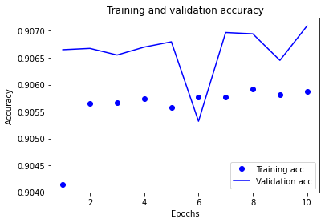
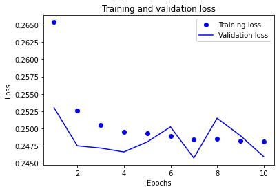
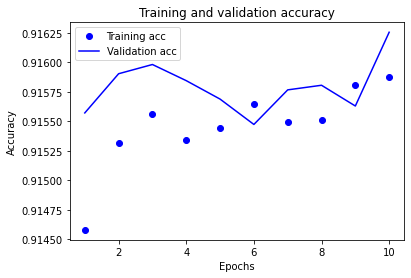
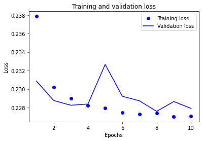
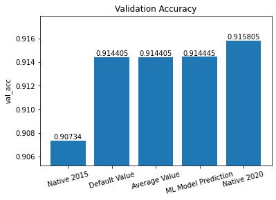
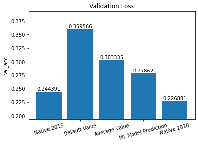

# Cross-Dataset Model Adaptation Feasibility Study: Image
This directory contains the example program output that explains some of the desicions and conclusions in the projects.  
For more details about how the images are created and what their meaning is, please check `Project_Interactive_Demo.ipynb`.
## Notice
Because the background of the axes area in the image is transparent, please check the images with a **bright** background color.
## Files
### acc_2015.png
The change of training and validation **accuracy** when test training the **2015 model**  

### loss_2015.png
The change of training and validation **loss** when test training the **2015 model**  

### acc_2020.png
The change of training and validation **accuracy** when test training the **2020 model**  

### loss_2020.png
The change of training and validation **loss** when test training the **2020 model**  

### acc_all.png
Comparing the validation **accuracy** between the prediction of native models and the model adoptation way with different data-making-up methods  

### acc_loss.png
Comparing the validation **loss** between the prediction of native models and the model adoptation way with different data-making-up methods  
